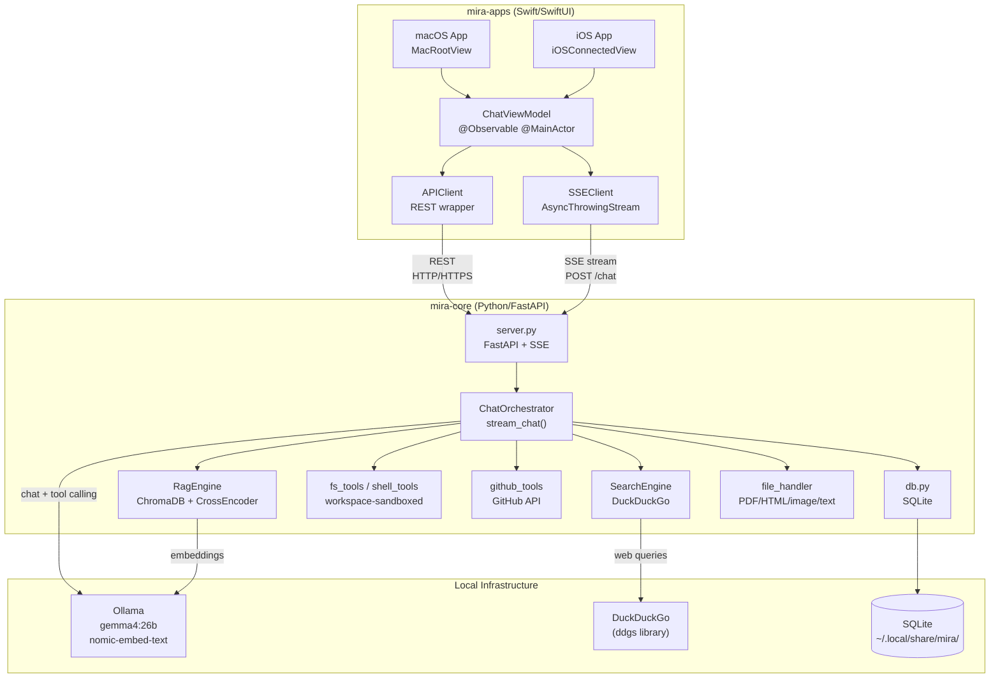
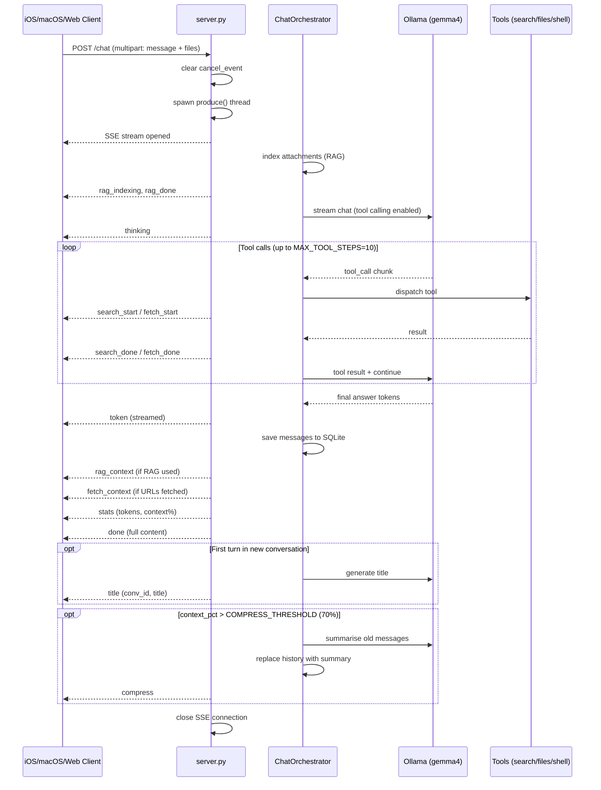
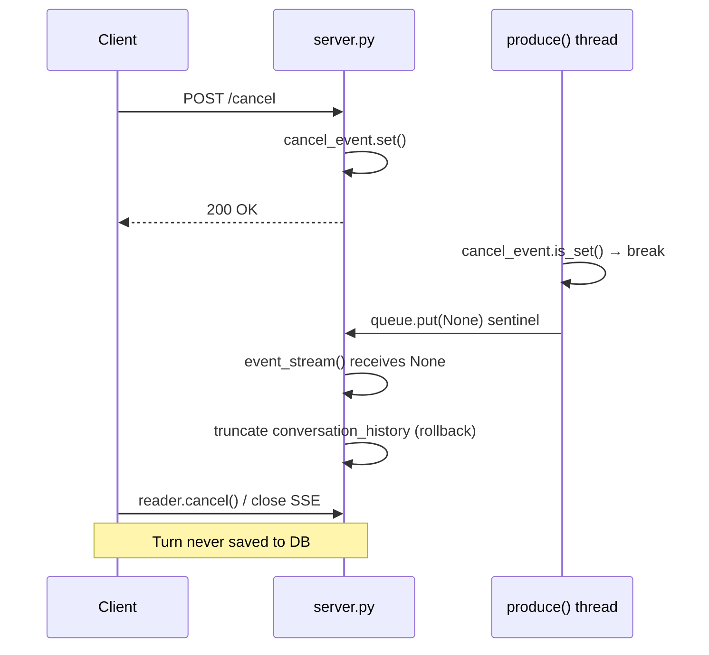
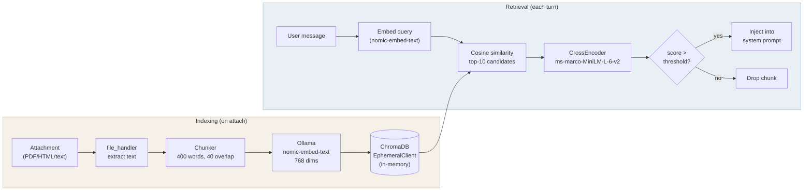
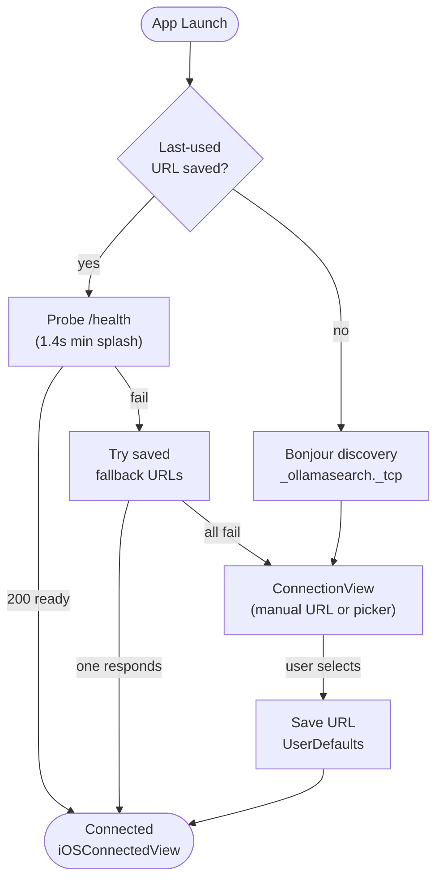
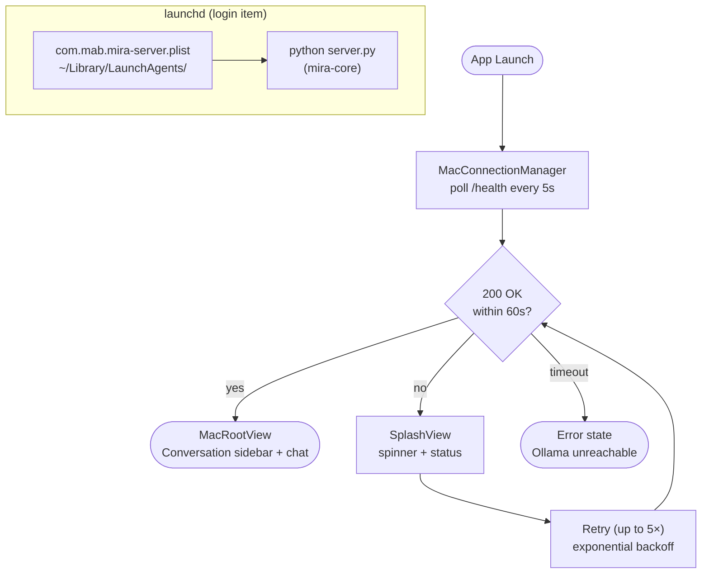

# Architecture Diagrams

Mermaid diagrams for the Mira system. Render in any Markdown viewer that supports Mermaid (GitHub, VS Code with extension, etc.).

## System Overview

## Turn Lifecycle (SSE event flow)

## Cancel / Stop flow

## RAG Pipeline

## iOS Connection Flow

## macOS Server Startup

